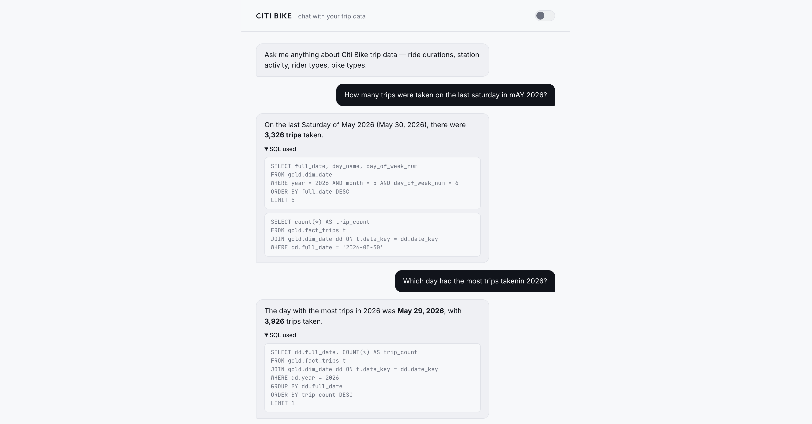
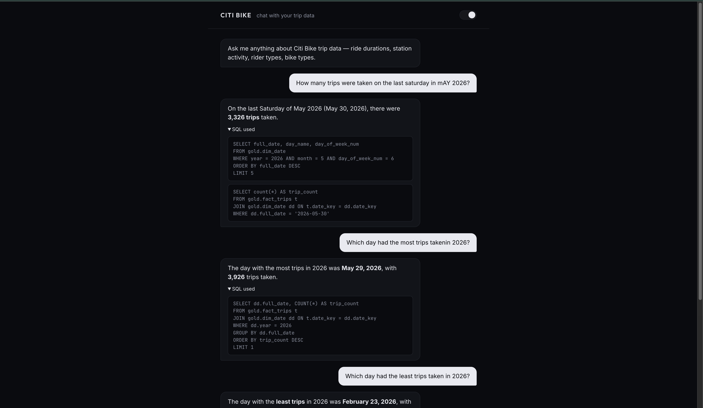

# Citi Bike Data Pipeline

A hybrid warehouse pipeline — MinIO as an object-store landing zone, Postgres for the mutable bronze/silver layers, ClickHouse for the gold star schema — that ingests Citi Bike trip data from S3, transforms it through bronze, silver, and gold layers, and serves analytical queries. Fully orchestrated with Prefect and containerised with Docker Compose. (See [Key Design Decisions](#key-design-decisions) for why bronze is Postgres rather than ClickHouse querying Parquet directly.)

---

## Architecture

```
Citi Bike S3 (source)
        ↓
[Prefect — monthly schedule]
        ↓
ingest.py → MinIO              raw Parquet files (bronze layer)
        ↓
loader.py → Postgres           bronze.trips (~9.0M rows, COPY-loaded)
        ↓
dbt-postgres:
  bronze.bronze_trips          exact copy of source, typed
  silver.int_trips_cleaned     cleaned, deduplicated, timezone-corrected (single incremental scan)
  silver.silver_trips          valid rows only (view over int_trips_cleaned)
  silver.silver_trips_rejected quarantined rows + why (view over int_trips_cleaned)
  snapshots.station_snapshot   SCD Type 2 station history
        ↓
dbt-clickhouse:
  gold.dim_date                date dimension (date spine, integer YYYYMMDD key)
  gold.dim_station             station dimension with SCD Type 2 (ASOF-joined by ride time)
  gold.dim_rider_type          rider type dimension
  gold.dim_bike_type           bike type dimension
  gold.fact_trips              fact table, star schema (~4.9M rows)
        ↓
DBeaver                        connects to Postgres + ClickHouse (least-privilege roles)
        ↓
agent/backend (FastAPI)        DeepSeek tool-calling agent, read-only ai_agent
                                ClickHouse user scoped to gold.* only
        ↓
agent/frontend (React + TS)    minimal chat UI → http://localhost:3000
```

---

## Stack

| Layer | Tool | Role |
|---|---|---|
| Source | Citi Bike S3 | Public trip data, monthly zip files |
| Data Lake | MinIO | Local S3-compatible object storage |
| Operational DB | Postgres 16 | Bronze + silver layers, snapshots |
| Warehouse | ClickHouse 24.3 | Gold layer, columnar analytical queries |
| Transformation | dbt (postgres + clickhouse) | Bronze → silver → gold models |
| Orchestration | Prefect 3 | Monthly schedule, task retries, UI |
| Data Catalog | dbt docs | Model docs, column descriptions, tests, and lineage generated from the project itself |
| Chat Agent | FastAPI + DeepSeek (OpenAI-compatible) | Tool-calling agent that writes/executes read-only SQL against the gold layer |
| Chat UI | React + Vite + TypeScript | Minimal dark/light chat frontend (Inter/Outfit/JetBrains Mono), served via nginx |
| Containerisation | Docker Compose | Full stack, single command startup |

---

## Project Structure

```
citi-bike-data/
├── .github/workflows/
│   └── ci.yml                    ruff check, pytest (root + agent), dbt parse
├── scripts/
│   ├── config/                 dataclass-based config, env var driven
│   ├── ingestion/               S3 fetch, zip extract, Parquet conversion
│   ├── storage/                 MinIO client wrapper
│   ├── loading/                 MinIO → Postgres bronze loader (COPY-based)
│   ├── quality/                 Soda data quality checks
│   ├── orchestration/           Prefect flow and task definitions
│   ├── sql/                      Postgres init: schemas + roles
│   ├── minio/                    MinIO bucket + policy init
│   └── pipeline.py               ingest + load orchestration entry point
├── dbt/
│   ├── models/
│   │   ├── bronze/             bronze_trips.sql
│   │   ├── silver/             int_trips_cleaned.sql (incremental, single scan),
│   │   │                        silver_trips.sql / silver_trips_rejected.sql (views)
│   │   └── gold/                dim_date, dim_station, dim_rider_type,
│   │                            dim_bike_type, fact_trips
│   ├── snapshots/               station_snapshot.sql (SCD Type 2)
│   ├── macros/
│   ├── dbt_project.yml
│   └── profiles.yml
├── agent/
│   ├── backend/                 FastAPI + DeepSeek tool-calling agent
│   │   ├── database.py          live gold.* schema introspection + read-only SQL execution/guardrails
│   │   ├── agent.py             system instructions, tool loop, DeepSeek client
│   │   ├── server.py            FastAPI app — POST /api/chat
│   │   ├── main.py              standalone CLI chat loop
│   │   ├── tests/               guardrail tests for execute_sql_query
│   │   ├── requirements.txt
│   │   ├── requirements-dev.txt
│   │   └── Dockerfile
│   └── frontend/                React + Vite + TypeScript chat UI
│       ├── src/
│       │   ├── App.tsx          chat state, message list, composer, dark/light theme toggle
│       │   └── markdownLite.ts  safe **bold**/bullet renderer for agent replies
│       ├── nginx.conf           serves the build, proxies /api → agent-api
│       └── Dockerfile
├── clickhouse/
│   ├── config.xml
│   ├── users.xml
│   └── init.sh                   creates data_engineer / data_analyst / ai_agent users
├── minio/policies/                analyst + engineer access policies
├── docs/
│   └── data_register.md
├── tests/
│   ├── conftest.py
│   ├── test_ingest.py
│   ├── test_storage.py
│   └── test_loader.py
├── docker-compose.yml
├── Dockerfile
├── prefect.yaml
└── pyproject.toml
```

---

## Prerequisites

- Docker Desktop
- Python 3.12+
- Node.js 22+ (only needed for local frontend dev outside Docker)
- dbt-core, dbt-postgres, dbt-clickhouse
- Prefect 3
- A DeepSeek API key (for the chat agent)

---

## Quickstart

**1. Clone and configure environment**

```bash
git clone <repo>
cd citi-bike-data
cp .env.example .env
# Fill in the values in .env
```

**2. Start the full stack**

```bash
docker compose up -d
```

Services started:

- MinIO console → <http://localhost:9001>
- Prefect UI → <http://localhost:4200>
- Postgres → localhost:5432
- ClickHouse → localhost:8123 (HTTP), localhost:9009 (native)
- Chat agent API → <http://localhost:8000> (see [Chat Agent](#chat-agent))
- Chat UI → <http://localhost:3000>

**3. Run the pipeline manually**

```bash
prefect deployment run 'citibike_pipeline/citibike-monthly'
```

Watch progress at <http://localhost:4200>

**4. Browse the data catalog (dbt docs)**

Regenerated automatically at the end of every pipeline run:

```bash
cd dbt && dbt docs generate --profiles-dir . --target dev && dbt docs serve --profiles-dir .
```

---

## Environment Variables

```bash
cp .env.example .env
```

`.env.example` is the source of truth for every variable the stack needs — Postgres (admin, `data_engineer`, `data_analyst` passwords), MinIO (root + engineer/analyst keys), ClickHouse (`data_engineer`/`ai_agent` passwords), and the DeepSeek API key for the chat agent. Fill in real values in `.env`; nothing in the repo besides `.env.example` should contain a real secret.

---

## Data Layers

### Bronze

Raw Citi Bike trip data landed from MinIO Parquet files into Postgres with no transformations. Two metadata columns added: `_source_file` and `_ingested_at`.

### Silver

`int_trips_cleaned` is the single incremental scan over bronze — cleaning, dedup, and quarantine flagging all happen here once. `silver_trips` and `silver_trips_rejected` are thin views splitting on `rejection_reason`, so downstream consumers see the same shape as before. Transformations applied:

- Duplicates removed on `ride_id`
- Timestamps converted from UTC to `America/New_York` (single conversion — the raw column is already `timestamptz`)
- `ride_duration_minutes` computed
- Station names and IDs cleaned (`NULLIF` on empty strings); a missing `station_id` with a surviving `station_name` is backfilled from an unambiguous name→id lookup built from the rest of the data — station IDs don't change over time, so a name seen with exactly one other ID elsewhere is safe to fill in
- Invalid rides quarantined, not dropped: duration ≤ 0 or > 1440 minutes, missing coordinates → `silver_trips_rejected`, tagged with why

### Gold (Star Schema)

Business-ready dimensional model in ClickHouse:

| Model | Rows | Description |
|---|---|---|
| `dim_date` | ~1,977 | Date spine from 2021-01-01 to latest data, `date_key` as `YYYYMMDD` `UInt32` |
| `dim_station` | 939 | Stations with SCD Type 2 history, `station_key` unique per version |
| `dim_rider_type` | 2 | Member / casual |
| `dim_bike_type` | 3 | Electric / classic / docked |
| `fact_trips` | ~4.86M | One row per ride, FK to all dimensions, `ORDER BY (date_key, start_station_key)` — rides with no resolvable station are excluded (~0.3%) |

---

## dbt Tests

42 data tests across all layers, including `relationships` tests from every `fact_trips` FK to its dimension and `accepted_values` on the dimension enums:

```bash
# Postgres layers (bronze + silver)
dbt test --target dev --select bronze_trips int_trips_cleaned silver_trips silver_trips_rejected --profiles-dir .

# ClickHouse layers (gold)
dbt test --target clickhouse --select gold.* --profiles-dir .
```

---

## Orchestration

The pipeline runs on the 1st of every month at 06:00 AM (New York time).

```
Task execution order:
1.  ingest              download + convert to Parquet → MinIO
2.  bronze_load         MinIO → Postgres bronze.trips (COPY)
3.  quality_check       Soda checks on bronze.trips
4.  dbt_bronze          bronze.trips → bronze.bronze_trips
5.  dbt_silver          bronze_trips → silver.int_trips_cleaned / silver_trips / silver_trips_rejected
6.  dbt_elementary      Elementary monitoring models in silver
7.  dbt_snapshot        silver_trips → snapshots.station_snapshot (SCD Type 2)
8.  dbt_gold            silver → ClickHouse gold layer (5 models)
9.  dbt_test_dev        tests on bronze + silver
10. dbt_test_ch         tests on gold
11. dbt_docs_generate   regenerate dbt docs (model docs, tests, lineage)
```

Each task has automatic retries, and a failure stops the flow before any downstream layer is built on bad data.


---

## Chat Agent

A minimal chat UI for asking questions about the gold layer in plain English — "What was the average ride duration for casual riders versus members?" — backed by a tool-calling agent that writes and executes the SQL itself. Dark by default with a light-mode toggle, persisted to `localStorage`.

| Light | Dark |
|---|---|
|  |  |

```
web browser → agent/frontend (React + TS, nginx)
                    ↓ /api/chat (proxied)
              agent/backend (FastAPI)
                    ↓ DeepSeek tool-calling loop
              gold.* (ClickHouse, ai_agent user)
```

**How it works:**

1. At startup, `agent/backend/database.py` introspects `system.columns` for `gold.*` live (via the same read-only `ai_agent` user) and probes the actual `DISTINCT` values of the rider/bike-type dimension columns. This becomes the schema context baked into the system prompt — it reflects the real dbt models, not a hand-maintained description that can drift when a model changes.
2. `agent/backend/agent.py` sends the user's question to DeepSeek along with that schema context and the join keys between `fact_trips` and its dimensions.
3. DeepSeek responds with a tool call containing a generated SQL query. The loop keeps `tools` available on every turn — required for DeepSeek's function-calling to behave correctly across multiple rounds.
4. `agent/backend/database.py` executes that query against ClickHouse and returns the rows.
5. DeepSeek reads the results and writes the final plain-English answer, which the UI shows along with a collapsible "SQL used" section.

**Guardrails** (defense in depth — each layer works even if another fails):

- App layer: only a single `SELECT`/`WITH` statement is allowed per call; a keyword block-list rejects `DROP`, `DELETE`, `UPDATE`, `INSERT`, `ALTER`, `CREATE`, and other mutating statements — including keywords hidden inside a `WITH ... DELETE` CTE. Covered by 29 guardrail tests in `agent/backend/tests/test_database.py` (statement-count enforcement, every forbidden keyword, case-insensitivity, and word-boundary checks so identifiers like `inserted_at` don't false-positive on `INSERT`).
- Database layer: the agent connects as a dedicated `ai_agent` ClickHouse user (see `clickhouse/init.sh`) that is granted `SELECT` on `gold.*` only — no access to `silver`/`snapshots`/`bronze` — and created with `SETTINGS readonly = 2`, which makes ClickHouse itself reject any write statement regardless of what the app layer does.
- Correctness: ClickHouse string comparisons are case-sensitive, and dimension tables store both a raw value (`rider_type = 'casual'`) and a display value (`rider_type_desc = 'Casual'`). The system prompt instructs the agent to filter with `lower(column) = lower('value')` unless it's certain of exact casing, so a wrong guess returns the right rows instead of silently returning zero.

**Run standalone (CLI, no Docker):**

```bash
cd agent/backend
pip install -r requirements.txt
python main.py
```

**Run via Docker Compose** (part of `docker compose up -d`, see [Quickstart](#quickstart)): the `agent-api` service builds from `agent/backend/`, and `web` builds from `agent/frontend/` and serves the UI at <http://localhost:3000>, with nginx proxying `/api/*` to `agent-api`.

---

## DBeaver Connections

Connect with the least-privilege `data_analyst` role for read-only exploration; use `data_engineer` only if you need to write.

**Postgres (bronze + silver)**

| Field | Value |
|---|---|
| Host | localhost |
| Port | 5432 |
| Database | citi-bike |
| User | `data_analyst` (read-only) or `data_engineer` |
| Password | `ANALYST_PASSWORD` or `DB_PASSWORD` from `.env` |

**ClickHouse (gold)**

| Field | Value |
|---|---|
| Host | localhost |
| Port | 9009 |
| Database | gold |
| User | `data_analyst` (read-only) or `data_engineer` |
| Password | `ANALYST_PASSWORD` or `CLICKHOUSE_ENGINEER_PASSWORD` from `.env` |

---

## Running Tests

```bash
# Root pipeline (ingest, storage, loader)
pytest tests/ -v

# Chat agent guardrails (needs agent/backend/requirements-dev.txt)
pytest agent/backend/tests -v
```

61 unit tests total: 32 covering ingest, storage, and loader modules; 29 covering the chat agent's SQL guardrails.

---

## Key Design Decisions

**Idempotency.** Every layer checks before writing. The pipeline is safe to re-run at any time and already-processed files are skipped at every stage.

**Medallion architecture.** Bronze is immutable. Silver is replayable from bronze. Gold is replayable from silver. A bug at any layer can be fixed and replayed without re-ingesting from source.

**SCD Type 2 on stations.** Station names and coordinates change over time. dbt snapshots track the full history, and `fact_trips` resolves each ride to the station version that was actually true at ride time via a ClickHouse `ASOF JOIN` on `valid_from`/`valid_to` — not just a lookup of whatever the station's attributes are today. `station_key` is unique per version (sourced from `dbt_scd_id`, not the natural `station_id`), which is what makes the point-in-time join actually mean something.

**ClickHouse bridge tables.** Gold models read from Postgres silver via ClickHouse's PostgreSQL engine. No data is copied and ClickHouse queries Postgres directly. Only the gold layer is physically stored in ClickHouse.

**Why bronze lives in Postgres, not queried straight off MinIO's Parquet.** ClickHouse can query S3-compatible object storage directly via its S3 table engine, so an obvious question is why this pipeline hops through a Postgres bronze table at all instead of pointing ClickHouse straight at the raw Parquet files. The answer is that Postgres gives the rest of the pipeline a mutable staging surface: dbt's incremental models need `MERGE`/upsert semantics keyed on `ride_id`, Soda's quality checks run as row-level SQL assertions against a real table, and re-loading a corrected file means updating rows in place rather than re-deriving the whole layer from immutable object storage. Object storage is the right fit for gold, where the shape is fixed and queries are append-mostly — it's the wrong fit for bronze, where the whole point is DML.
