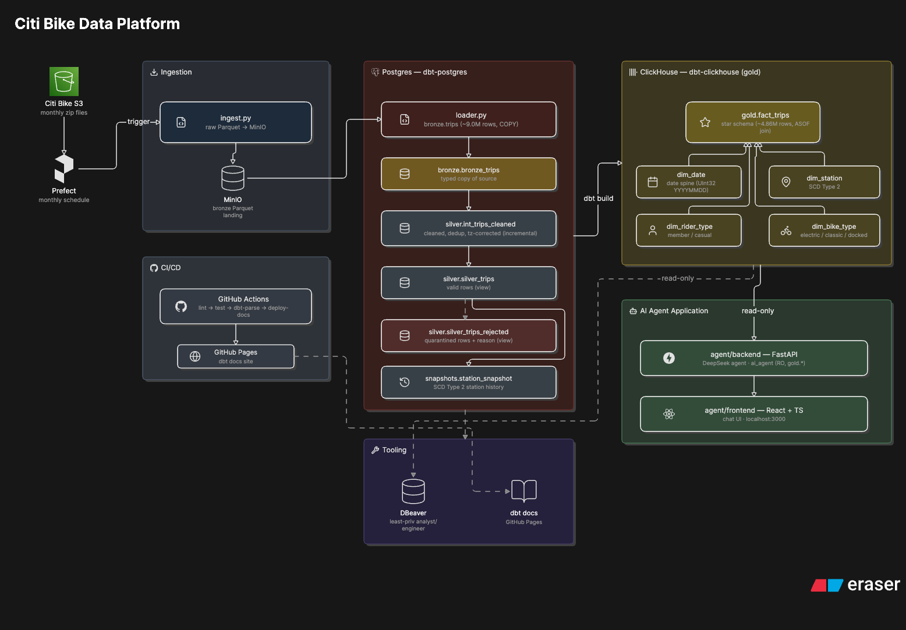
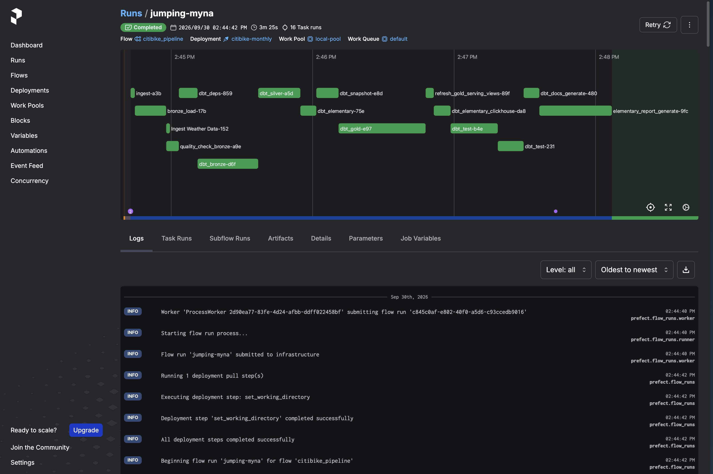
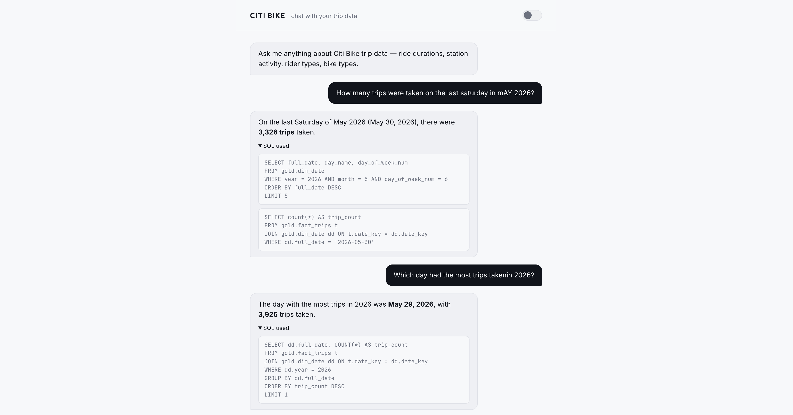
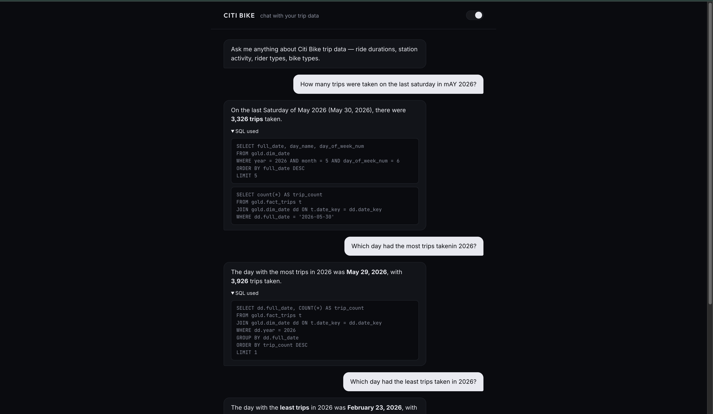
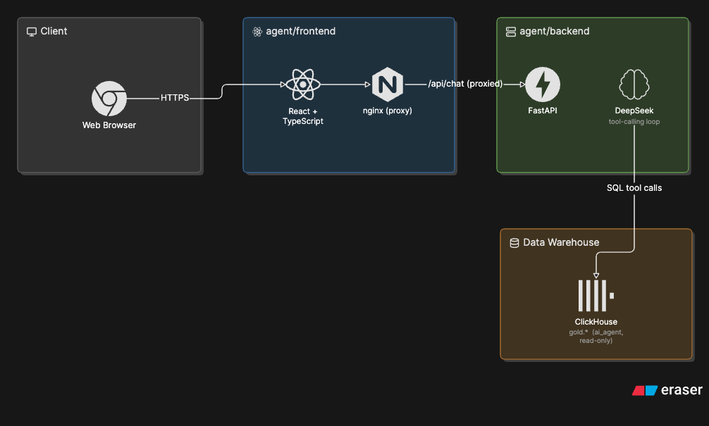

# Citi Bike Data Pipeline

Ingests Citi Bike trip data from S3 and hourly weather from Open-Meteo, then transforms it through bronze, silver, gold and marts layers. MinIO is the landing zone, Postgres holds bronze and silver, and ClickHouse holds gold and marts. Prefect runs the pipeline on Docker Compose, and a chat agent answers questions about the data in plain English. See [Key Design Decisions](#key-design-decisions) for why bronze is Postgres rather than ClickHouse reading Parquet directly.

---

## Architecture



---

## Stack

| Layer | Tool | Role |
|---|---|---|
| Source | Citi Bike S3 & Open-Meteo | Public trip data (monthly zips) and historical weather API |
| Data Lake | MinIO | Local S3-compatible object storage |
| Operational DB | Postgres 16 | Bronze + silver layers, snapshots |
| Warehouse | ClickHouse 24.3 | Gold and marts layers, columnar analytical queries |
| Transformation | dbt (postgres + clickhouse) | Bronze → silver → gold → marts models |
| Orchestration | Prefect 3 | Monthly schedule, task retries, UI |
| Data Catalog | dbt docs | Model docs, columns, tests and lineage, published at [ppius6.github.io/citi-bike-data](https://ppius6.github.io/citi-bike-data/) |
| Observability | Soda, dbt tests, Elementary | Soda checks bronze on landing, dbt tests check every layer, and Elementary tracks volume anomalies and run history ([report](https://ppius6.github.io/citi-bike-data/elementary/)) |
| Chat Agent | FastAPI + DeepSeek + sentence-transformers | Tool-calling agent that writes read-only SQL against gold and marts, with long-term vector memory |
| Chat UI | React + Vite + TypeScript | Chat frontend, served via nginx |
| Containerisation | Docker Compose | Full stack, single command startup |

---

## Prerequisites

- Docker Desktop
- Python 3.12+ and [uv](https://docs.astral.sh/uv/)
- Node.js 22+ (only for frontend development outside Docker)
- An LLM API key for the chat agent (DeepSeek by default, any OpenAI-compatible provider works)

---

## Quickstart

**1. Configure the environment**

```bash
git clone <repo>
cd citi-bike-data
cp .env.example .env
# Fill in the values in .env
```

`.env.example` lists every variable the stack needs: Postgres, MinIO and ClickHouse credentials, plus the LLM API key. Real secrets belong only in `.env`.

**2. Start the stack**

```bash
docker compose up -d
```

- MinIO console: <http://localhost:9001>
- Prefect UI: <http://localhost:4200>
- Postgres: localhost:5432
- ClickHouse: localhost:8123 (HTTP), localhost:9009 (native)
- Chat UI: <http://localhost:3000>

**3. Run the pipeline**

```bash
prefect deployment run 'citibike_pipeline/citibike-monthly'
```

Watch progress in the Prefect UI or with `docker compose logs -f pipeline`. On its own, the pipeline runs on the 1st of every month at 06:00 New York time.

**4. Browse the data catalog**

CI publishes the dbt docs to **<https://ppius6.github.io/citi-bike-data/>** and the Elementary report to **<https://ppius6.github.io/citi-bike-data/elementary/>** on every push to `main` (the `deploy-docs` job in `.github/workflows/ci.yml`).

To build them locally:

```bash
cd dbt && uv run dbt docs generate --profiles-dir . --target dev && uv run dbt docs serve --profiles-dir .

# Elementary report (needs its own `elementary` profile stanza in profiles.yml)
mkdir -p target/elementary
uv run edr report --profiles-dir . --project-dir . --profile-target dev --file-path target/elementary/index.html
```

When running dbt from your host, the ClickHouse target defaults to the hostname `clickhouse`, which only resolves inside Docker. From your own shell, set `CLICKHOUSE_HOST=localhost`.

---

## Data Layers

### Bronze

Raw trip data loaded from MinIO Parquet files into Postgres with no transformations, plus two metadata columns: `_source_file` and `_ingested_at`.

### Silver

`int_trips_cleaned` is the single incremental scan over bronze. Cleaning, deduplication and quarantine flagging all happen there. `silver_trips` and `silver_trips_rejected` are views that split its output on `rejection_reason`. Hourly weather goes straight into `silver_weather`.

- Duplicates removed on `ride_id`.
- Timestamps converted from UTC to `America/New_York`.
- `ride_duration_minutes` computed.
- Empty station names and IDs become `NULL`. A missing `station_id` is backfilled from the station's name when that name maps to exactly one ID elsewhere in the data.
- Invalid rides go to `silver_trips_rejected` with a reason instead of being dropped: duration ≤ 0 or > 1440 minutes, or missing coordinates.

### Gold (star schema)

Dimensional model in ClickHouse.

| Model | Rows | Description |
|---|---|---|
| `dim_date` | ~2,070 | Date spine from 2021-01-01 to latest data, `date_key` as `YYYYMMDD` `UInt32` |
| `dim_station` | 963 | Stations with SCD Type 2 history, `station_key` unique per version. `city` (Jersey City, Hoboken, New York City) comes from the station ID format |
| `dim_rider_type` | 2 | Member / casual |
| `dim_bike_type` | 3 | Electric / classic / docked |
| `dim_weather_code` | 28 | WMO weather code lookup |
| `fact_trips` | ~5.19M | One row per ride, FK to all dimensions, with hourly weather and `ride_distance_km`. `ORDER BY (date_key, start_station_key)`. Rides with no resolvable station (~0.3%) are excluded |

### Marts

Pre-aggregated tables built from gold, in their own ClickHouse schema (`marts`). They are rebuilt once a month with the rest of the pipeline, so they describe history, not live station status.

| Model | Rows | Grain and purpose |
|---|---|---|
| `daily_ride_summary` | ~53K | Date × rider type × bike type × weather × daylight. A refreshable materialized view for cheap system-wide counts and averages |
| `mart_station_flow` | ~2.4M | Station × date × hour. Departures, arrivals, net flow, round-trip share, distance and rider/bike mix. Only hours with activity have rows |
| `mart_demand_patterns` | ~115K | Station × day of week × hour. Typical departures and arrivals with p05/p95 bands and a `sample_size`. Quiet hours count as 0, keyed by `station_id` so a station's SCD2 versions share one baseline |
| `mart_city_flow` | ~420 | Start city × end city × month. Ride counts, average duration and distance, including Jersey City ↔ Hoboken crossings |

---

## dbt Tests

Data tests across all layers are implemented which cut across `relationships` tests from every `fact_trips` FK to its dimension, `accepted_values` on the dimension enums, and a reconciliation test that compares `fact_trips`'s row count to `silver_trips`'s. Any gap beyond the known station-less exclusion fails the build.

```bash
# Postgres layers (bronze + silver)
uv run dbt test --target dev --select bronze_trips int_trips_cleaned silver_trips silver_trips_rejected bronze_weather int_weather_cleaned silver_weather --profiles-dir .

# ClickHouse layers (gold + marts)
uv run dbt test --target clickhouse --select gold.* marts.* fact_trips_reconciles_with_silver_trips --profiles-dir .
```

---

## Data Quality and Observability

- **Soda** checks `bronze.trips` right after the raw data loads and before any dbt model runs. Checks are YAML files under `scripts/quality/`.
- **dbt tests** run on every layer: unique primary keys, foreign keys that resolve, valid enum values. Postgres layers run under the `dev` target and ClickHouse layers under `clickhouse`.
- **Elementary** monitors anomalies and records pipeline run history.
- **dbt docs** publish model docs, columns and lineage as a static site.

---

## Orchestration

The pipeline runs on the 1st of every month at 06:00 New York time, because Citi Bike publishes data monthly.

```
Task execution order:
1.  ingest              download + convert to Parquet → MinIO
2.  bronze_load         MinIO → Postgres bronze.trips (COPY)
3.  weather_ingest      Open-Meteo API → Postgres silver.silver_weather
4.  quality_check       Soda checks on bronze.trips
5.  dbt_bronze          bronze.trips → bronze.bronze_trips
6.  dbt_silver          bronze_trips → silver.int_trips_cleaned / silver_trips / silver_trips_rejected
7.  dbt_elementary      Elementary monitoring models in elementary
8.  dbt_snapshot        silver_trips → snapshots.station_snapshot (SCD Type 2)
9.  dbt_gold            silver → ClickHouse gold and marts layers
10. dbt_test_dev        tests on bronze + silver
11. dbt_test_ch         tests on gold + marts
12. dbt_docs_generate   regenerate dbt docs (model docs, tests, lineage)
13. elementary_report   regenerate Elementary's anomaly/observability report
```

Each task retries automatically, and a failure stops the flow before any downstream layer is built on bad data. After the gold and marts build, a refresh step runs `SYSTEM REFRESH VIEW` on `marts.daily_ride_summary`.



---

## Chat Agent

A chat UI for asking questions about the data in plain English, such as "What was the average ride duration for casual riders versus members?" A tool-calling agent writes and runs the SQL. Dark theme by default, with a light-mode toggle saved to `localStorage`.

| Light | Dark |
|---|---|
|  |  |

### Architecture



**How it works:**

1. **Startup:** `agent/backend/database.py` reads `system.columns` for `gold` and `marts` through the read-only `ai_agent` user and probes the real values of the rider and bike type columns. The result fills the `{db_schema}` slot in the system prompt, so the schema the agent sees always matches the dbt models.
2. **Prompt:** the join and grounding rules live in [`agent/backend/prompts/system_instructions.md`](agent/backend/prompts/system_instructions.md). They tell the agent which table to use for which question: `fact_trips` by default, `marts.daily_ride_summary` for system-wide totals, `marts.mart_station_flow` for station flow, and `marts.mart_demand_patterns` for typical demand, and `dim_station.city` and `marts.mart_city_flow` for city questions.
3. **Memory:** the agent embeds the question with a local `sentence-transformers` model (`all-MiniLM-L6-v2`) and searches `agent.memory` in ClickHouse with `cosineDistance`. The closest past questions and their SQL are added to the prompt as examples.
4. **Query loop:** `agent/backend/agent.py` sends the question, chat history, schema and examples to the LLM, which replies with a tool call containing SQL. Tools stay available on every turn, which DeepSeek's function calling needs across multiple rounds.
5. **Saving:** once the agent has a final answer, it embeds the one most successful query and stores it in `agent.memory`.

**Guardrails:**

- **App layer:** one `SELECT` or `WITH` statement per call. A keyword block-list rejects `DROP`, `DELETE`, `UPDATE`, `INSERT`, `ALTER`, `CREATE` and similar, including inside a `WITH ... DELETE` CTE. 29 tests in `agent/backend/tests/test_database.py` cover this, including word boundaries so `inserted_at` doesn't trip `INSERT`.
- **Database layer:** the agent connects as `ai_agent` (see `infra/clickhouse/init.sh`), which has `SELECT` on `gold.*` and `marts.*` and `INSERT`/`SELECT` on `agent.memory`. Table-level grants stop any other write.
- **Memory hygiene:** exploratory queries are tracked, and only the final successful query is saved.
- **Prompt rules:** case-insensitive filtering, grounding every number in a query result, and which table to use for which question are all defined in [`agent/backend/prompts/system_instructions.md`](agent/backend/prompts/system_instructions.md).

**Run standalone (CLI, no Docker):**

```bash
cd agent/backend
pip install -r requirements.txt
python main.py
```

**Run with Docker Compose:** `docker compose up -d` builds `agent-api` from `agent/backend/` and `web` from `agent/frontend/`. The UI is at <http://localhost:3000>, with nginx proxying `/api/*` to `agent-api`. The system prompt is baked into the image, so rebuild after editing it:

```bash
docker compose up -d --build agent-api
```

---

## Database Connections

Use the read-only `data_analyst` role for exploration. Use `data_engineer` only when you need to write.

**Postgres (bronze + silver)**

| Field | Value |
|---|---|
| Host | localhost |
| Port | 5432 |
| Database | citi-bike |
| User | `data_analyst` (read-only) or `data_engineer` |
| Password | `ANALYST_PASSWORD` or `DB_PASSWORD` from `.env` |

**ClickHouse (gold + marts)**

| Field | Value |
|---|---|
| Host | localhost |
| Port | 9009 |
| Database | gold (or marts) |
| User | `data_analyst` (read-only) or `data_engineer` |
| Password | `ANALYST_PASSWORD` or `CLICKHOUSE_ENGINEER_PASSWORD` from `.env` |

---

## Key Design Decisions

- Idempotency is maintained as every layer checks before writing, so a re-run is safe and already-processed files are skipped.

- Bronze is immutable, silver replays from bronze, and gold and marts replay from silver. You can fix a bug at any layer and replay without re-ingesting from source. Empty fields in source CSVs become `NULL` at ingestion (`pd.read_csv(..., keep_default_na=False, na_values=[""])` in `ingest.py`). The source files do not reliably tell empty strings from missing values, and this setting avoids pandas turning real values like "NA" into nulls.

- We assume that station(s) could change. We therefore design to keep the full history. `fact_trips` resolves each ride to the station version that was current at ride time with a ClickHouse `ASOF JOIN` on `valid_from`/`valid_to`. `station_key` is unique per version, taken from `dbt_scd_id`, which is what makes the point-in-time join work. Marts that need one row per physical station key on `station_id` instead.

- Gold models read Postgres silver through ClickHouse's PostgreSQL engine, so no data is copied. Only gold and marts are stored in ClickHouse.

- The bronze layer is Postgres and not Parquet on MinIO. ClickHouse can query S3-compatible storage directly, so the extra Postgres hop needs a reason. dbt incremental models need `MERGE`/upsert on `ride_id`, Soda runs row-level SQL assertions against a real table, and reloading a corrected file means updating rows in place. Object storage suits gold, where the shape is fixed and writes are append-mostly. It doesn't suit bronze, where the job is DML.